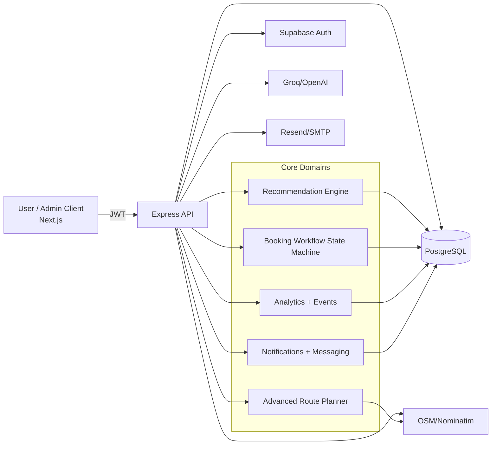

# TourMind AI System Design

## Notes
- Internal booking coordination model (no external payment processing).
- Role-based access for user/admin.
- Fallback and retry paths for reliability.
- Event tracking feeds recommendation scoring and admin insights.
